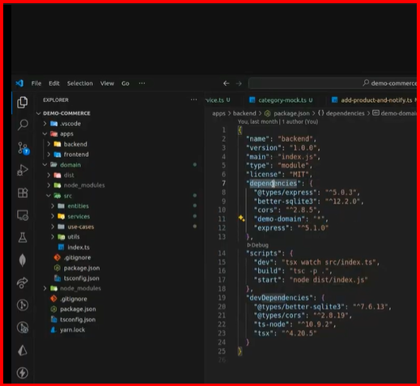

# Guia paso a paso del proyecto agency-dev

## Paso 1 - Crear proyecto, instalaciones, configuraciones y estructura de carpetas

 . npm init -y              # Inicia el proyecto sin preguntar nombre
 . npm i -D type script     # Inicializa ts --
 . tsc --init               # Crea en la raiz config basica de tsconfig.json
 . tsc -p .                 # Para transpilar ts y crear la carpeta dist si aun no está hecho, ejemplo en domiain, backend frontend y raiz

backend: node dist/index.js # Para correr el script

# Paso 2 Cada carpeta debe tener su index.ts
 . Ejemplo en domain 
                entities --- index.ts
                services --- index.ts
                use-cases --- index.ts
                index.ts
 . tsc -p .                 # transpilar cada vez que hacemos un new file ts
 npm run test Testeo

# Carpeta entities
    Aqui va toda la logica de interfaces
# Carpeta use-cases
    Aqui va toda la logica de lo que hay que hacer.
    Tambien va el archivo spec.ts para hacer los test
    Instalamos la dependencia con el sigueinte comando
. npm install -D vitest
en package.json agregar  
"scripts": {
    "test": "vitest"
  },

## Para investigar
* averiguar para hacer que mi dominio sea una depéndencia
